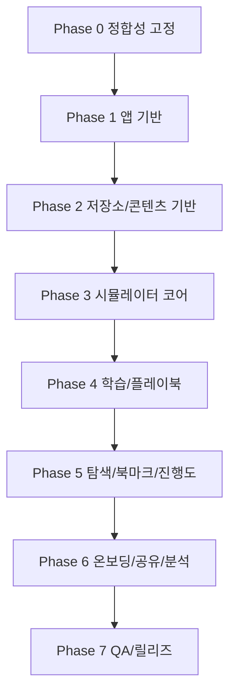

# 실행 작업계획 (Implementation-Ready TodoList)

## 1. v1 범위 고정
- 포함:
  - Track A~C 학습/미션
  - 고충실도 tmux 시뮬레이터 핵심 기능
  - Cheatsheet/Bookmark/Progress
  - 실무 플레이북 3종 (`tmux.conf`, 세션 유지, Tailscale SSH)
  - 공유 페이지 + OG/Twitter 카드
  - Cloudflare Web Analytics 라우트 기반 측정
- 제외:
  - 백엔드/API/로그인/클라우드 동기화
  - Track D/E 본 콘텐츠 (랜딩 preview만 허용)

## 2. 작업 단위 규칙 (중요)
- 1 Task = 1 PR 기준
- 목표 분량: 4~8시간 내 완료 가능한 크기
- 각 Task는 다음을 반드시 포함:
  - 코드/문서 산출물
  - 테스트 또는 검증 방법
  - 완료 체크 항목
- Task가 8시간을 넘기면 즉시 쪼갠다.

## 2.1 진행 체크리스트
- [x] `E-000` 공통 규약/라우트/식별자 표준 확정
- [x] `E-001` 스펙 간 충돌 제거(`Slug` 통일, v1 범위 명시)
- [x] `E-002` UI/온보딩 문구 확정(과장 금지 카피 룰 반영)
- [x] `E-010` Vite + React + TS 초기화
- [x] `E-011` 라우터 골격 생성
- [x] `E-012` 공통 앱 셸 레이아웃
- [ ] `E-013` 전역 store skeleton
- [ ] `E-014` 에러/로딩/빈상태 컴포넌트
- [ ] `E-015` 정적 배포 기본 설정
- [ ] `E-020` IndexedDB 스키마 구현
- [ ] `E-021` Repository 레이어 구현
- [ ] `E-022` DB migration 프레임워크
- [ ] `E-023` export/import/reset 기능
- [ ] `E-024` 콘텐츠 schema/loader
- [ ] `E-030` 시뮬레이터 도메인 모델 + reducer
- [ ] `E-031` 키입력 파이프라인 + prefix
- [ ] `E-032` pane/window/session 핵심 조작
- [ ] `E-033` copy-mode + 검색
- [ ] `E-034` 명령 모드(`:`) subset
- [ ] `E-035` snapshot 저장/복원
- [ ] `E-036` `SIMULATED` 차이 안내 UI
- [ ] `E-040` 채점 룰 엔진
- [ ] `E-041` 힌트 단계 엔진
- [ ] `E-042` Track A 콘텐츠
- [ ] `E-043` Track B 콘텐츠
- [ ] `E-044` Track C 콘텐츠
- [ ] `E-045` 플레이북 3종 콘텐츠
- [ ] `E-046` 플레이북 UI + 명령 복사
- [ ] `E-047` XP/레벨/스트릭/업적 계산기
- [ ] `E-050` Cheatsheet 검색
- [ ] `E-051` Quick Practice 연결
- [ ] `E-052` Bookmark/Notes CRUD
- [ ] `E-053` Progress 페이지
- [ ] `E-060` 온보딩 라우트/화면
- [ ] `E-061` 온보딩 첫 미션 통과 라우트
- [ ] `E-062` 공유 라우트 + payload
- [ ] `E-063` 정적 OG/Twitter 메타 페이지
- [ ] `E-064` OG 이미지 생성/버저닝
- [ ] `E-065` Cloudflare Analytics 연동
- [ ] `E-066` KPI 라우트 맵 검증
- [ ] `E-070` Unit/Integration 테스트 세트
- [ ] `E-071` E2E 스모크 플로우
- [ ] `E-072` 호환성/접근성/성능 튜닝
- [ ] `E-073` CI 파이프라인
- [ ] `E-074` GitHub Pages 자동 배포
- [ ] `E-075` Cloudflare Pages 자동 배포
- [ ] `E-076` 릴리즈 런북 + 최종 게이트

## 3. 선후관계 개요

## 4. 상세 Todo (실행 순서)
## 4.1 Phase 0: 문서 정합성 고정
| ID | 작업 | 선행 | 예상 |
|---|---|---|---|
| `E-000` | 공통 규약/라우트/식별자 표준 확정 | - | S |
| `E-001` | 스펙 간 충돌 제거(`Slug` 통일, v1 범위 명시) | `E-000` | S |
| `E-002` | UI/온보딩 문구 확정(과장 금지 카피 룰 반영) | `E-000` | S |

### Phase 0 게이트
- 라우트/파라미터 네이밍 불일치 0건
- v1 범위와 각 스펙 범위 충돌 0건

## 4.2 Phase 1: 앱 기반 골격
| ID | 작업 | 선행 | 예상 |
|---|---|---|---|
| `E-010` | Vite + React + TS 초기화 | `E-001` | S |
| `E-011` | 라우터 골격 생성 (`learn/practice/cheatsheet/playbooks/progress/share/onboarding`) | `E-010` | S |
| `E-012` | 공통 앱 셸 레이아웃 (좌/중/우 패널) | `E-011` | M |
| `E-013` | 전역 store skeleton (`ui/simulator/curriculum/progress`) | `E-010` | S |
| `E-014` | 에러 바운더리/로딩/빈상태 컴포넌트 | `E-012` | S |
| `E-015` | 정적 배포 기본 설정 (base path, SPA fallback) | `E-011` | S |

### Phase 1 게이트
- 핵심 라우트 진입 가능
- 새로고침 라우팅 깨짐 없음

## 4.3 Phase 2: 로컬 데이터/콘텐츠 인프라
| ID | 작업 | 선행 | 예상 |
|---|---|---|---|
| `E-020` | IndexedDB 스키마 구현 | `E-013` | M |
| `E-021` | Repository 레이어 구현 | `E-020` | M |
| `E-022` | DB migration 프레임워크 | `E-020` | S |
| `E-023` | export/import/reset 기능 | `E-021` | M |
| `E-024` | 콘텐츠 schema + validator + loader | `E-013` | M |

### Phase 2 게이트
- 데이터 round-trip(export/import) 검증 통과
- 콘텐츠 로드 실패 시 안전 fallback 동작

## 4.4 Phase 3: tmux 시뮬레이터 코어
| ID | 작업 | 선행 | 예상 |
|---|---|---|---|
| `E-030` | 시뮬레이터 도메인 모델 + reducer 구현 | `E-013` | M |
| `E-031` | 키입력 파이프라인 + prefix(`Ctrl+b`, `Ctrl+a`) | `E-030` | M |
| `E-032` | pane/window/session 핵심 조작 구현 | `E-031` | L |
| `E-033` | copy-mode + 검색 시뮬레이션 | `E-032` | M |
| `E-034` | 명령 모드(`:`) subset 구현 | `E-032` | M |
| `E-035` | snapshot 저장/복원 연결 | `E-021`, `E-032` | M |
| `E-036` | `SIMULATED` 차이 안내 UI | `E-032` | S |

### Phase 3 게이트
- Track A~C 필수 동작 커버리지 95% 이상
- 키입력 반응 p95 목표 충족

## 4.5 Phase 4: 커리큘럼/채점/실무 플레이북
| ID | 작업 | 선행 | 예상 |
|---|---|---|---|
| `E-040` | 채점 룰 엔진 구현 | `E-032`, `E-024` | M |
| `E-041` | 힌트 단계 엔진 구현 | `E-040` | S |
| `E-042` | Track A 콘텐츠 작성/탑재 | `E-024`, `E-040` | M |
| `E-043` | Track B 콘텐츠 작성/탑재 | `E-024`, `E-040` | M |
| `E-044` | Track C 콘텐츠 작성/탑재 | `E-024`, `E-040` | M |
| `E-045` | 플레이북 3종 콘텐츠 탑재 | `E-024` | M |
| `E-046` | 플레이북 페이지 UI + 명령 복사 | `E-012`, `E-045` | M |
| `E-047` | XP/레벨/스트릭/업적 계산기 구현 | `E-040` | M |

### Phase 4 게이트
- 미션 pass/fail 결정성 보장
- 플레이북 3종 접근/복사/체크리스트 동작

## 4.6 Phase 5: 탐색성 기능 (Cheatsheet/Bookmark/Progress)
| ID | 작업 | 선행 | 예상 |
|---|---|---|---|
| `E-050` | Cheatsheet 인덱스/검색 구현 | `E-024` | M |
| `E-051` | Quick Practice 연결 구현 | `E-050`, `E-032` | S |
| `E-052` | Bookmark/Notes CRUD + 태그/정렬 | `E-021` | M |
| `E-053` | Progress 페이지 (요약/추천/마일스톤) | `E-047` | M |

### Phase 5 게이트
- 검색에서 5초 내 재접근 가능한 UX 확보
- 북마크/노트 영속 저장 확인

## 4.7 Phase 6: 온보딩/공유/분석
| ID | 작업 | 선행 | 예상 |
|---|---|---|---|
| `E-060` | 온보딩 라우트/화면 구현 (`start -> done`) | `E-012`, `E-047` | M |
| `E-061` | 온보딩 첫 미션 연결/통과 라우트 구현 | `E-060`, `E-040` | S |
| `E-062` | 공유 라우트 + payload 처리 구현 | `E-053` | M |
| `E-063` | 정적 OG/Twitter 메타 페이지 구성 | `E-062` | M |
| `E-064` | OG 이미지 생성/버저닝 정책 적용 | `E-063` | S |
| `E-065` | Cloudflare Web Analytics 연동 + SPA pageview | `E-011` | S |
| `E-066` | KPI 라우트 맵 검증 (온보딩/플레이북/공유) | `E-061`, `E-065` | S |

### Phase 6 게이트
- 공유 링크 미리보기 정상 (`summary_large_image`)
- Cloudflare 대시보드에서 핵심 라우트 관측 가능

## 4.8 Phase 7: QA/릴리즈
| ID | 작업 | 선행 | 예상 |
|---|---|---|---|
| `E-070` | Unit/Integration 테스트 세트 작성 | `E-047`, `E-052` | M |
| `E-071` | E2E 스모크 플로우 작성 | `E-060`, `E-062` | M |
| `E-072` | 브라우저 호환/접근성/성능 튜닝 | `E-071` | M |
| `E-073` | CI 파이프라인 구성 (lint/type/test/build) | `E-070` | S |
| `E-074` | GitHub Pages 자동 배포 | `E-073` | S |
| `E-075` | Cloudflare Pages 자동 배포 | `E-073` | S |
| `E-076` | 릴리즈 런북 + 최종 게이트 검증 | `E-072`, `E-075` | S |

### Phase 7 게이트
- 크리티컬 버그 0건
- 배포 채널 2곳 모두 정상

## 5. 병렬 작업 가이드
- 병렬 가능:
  - `E-013` 과 `E-015`
  - `E-022` 과 `E-024`
  - `E-042`, `E-043`, `E-044`
  - `E-052` 과 `E-053`
- 병렬 금지:
  - `E-032` 이전의 시뮬레이터 기능 확장
  - `E-063` 이전의 OG 이미지 최적화 작업

## 6. 최종 출고 게이트
- `G-01` 학습 핵심 플로우 완주 가능
- `G-02` 로컬 데이터 복구/백업 검증 통과
- `G-03` 공유/OG/Twitter 미리보기 통과
- `G-04` Cloudflare KPI 관측 가능
- `G-05` GitHub/Cloudflare 동시 배포 성공
- `G-06` 온보딩 완료율/첫 미션 전환율 측정 가능

## 7. 스펙 매핑
- 공통 규약: `/Users/hckim/repo/tmux-tuto/docs/01_PROJECT_CONVENTIONS.md`
- 아키텍처: `/Users/hckim/repo/tmux-tuto/docs/specs/01_APP_ARCHITECTURE_SPEC.md`
- 시뮬레이터: `/Users/hckim/repo/tmux-tuto/docs/specs/02_TMUX_SIMULATOR_SPEC.md`
- 커리큘럼/미션: `/Users/hckim/repo/tmux-tuto/docs/specs/03_CURRICULUM_MISSION_SPEC.md`
- 로컬 저장소: `/Users/hckim/repo/tmux-tuto/docs/specs/04_LOCAL_STORAGE_SPEC.md`
- 분석: `/Users/hckim/repo/tmux-tuto/docs/specs/05_ANALYTICS_CLOUDFLARE_SPEC.md`
- 공유/OG/Twitter: `/Users/hckim/repo/tmux-tuto/docs/specs/06_SHARE_OG_TWITTER_SPEC.md`
- QA/릴리즈: `/Users/hckim/repo/tmux-tuto/docs/specs/07_QA_RELEASE_SPEC.md`
- Cheatsheet/Bookmark: `/Users/hckim/repo/tmux-tuto/docs/specs/08_CHEATSHEET_BOOKMARK_SPEC.md`
- Gamification/Progress: `/Users/hckim/repo/tmux-tuto/docs/specs/09_GAMIFICATION_PROGRESS_SPEC.md`
- UX/UI/온보딩: `/Users/hckim/repo/tmux-tuto/docs/specs/10_UX_UI_ONBOARDING_SPEC.md`
- 실무 플레이북: `/Users/hckim/repo/tmux-tuto/docs/specs/11_PRACTICAL_PLAYBOOKS_SPEC.md`
